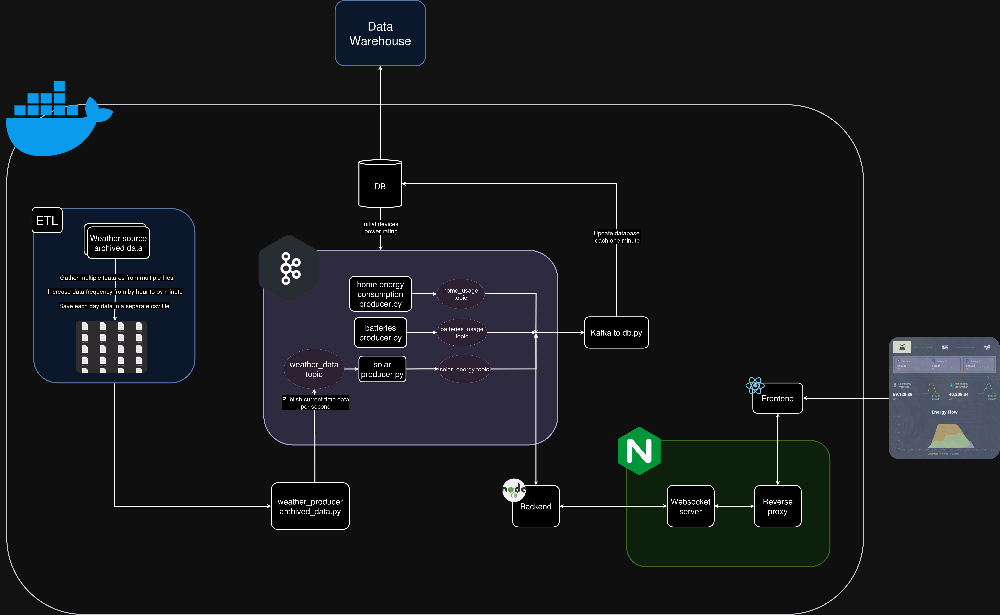
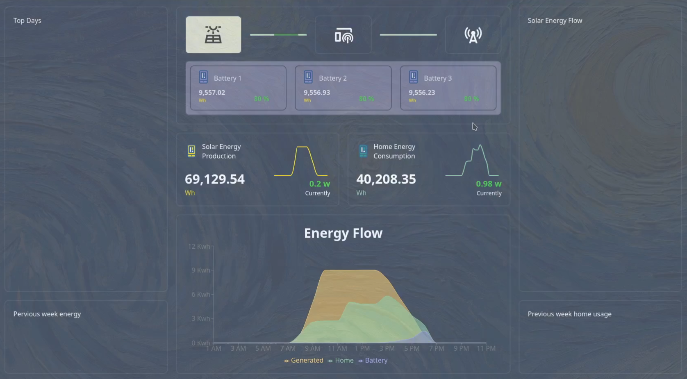

# solar-x
SolarX is a project aiming to practice a number of different tools, from the databases and etl related work, data streaming using kafka, data processing with kafka and python, web-sockets in the nodejs backend with kafka, to sending the data to the react frontend with web-sockets, with under docker and docker compose.

<br/>

### Technologies used in this project
- `Python` for data processing and etl work
- `Kafka` for handling the data stream per second
- `Nodejs` and python for the backend
- `Web-socket` for the communication between the backend and the frontend
- `React` for the frontend
- `MySQL` database to store the solar and home and batteries energies per hour (updated per minute)
- `Phpmyadmin` for monitoring the database
- `Docker` and `Docker-compose`
- `Nginx` as a reverse proxy to facilitate communication

<br/>

### Project Diagram


<br/>

### ERD Diagram


<br/>

### Demo




https://github.com/user-attachments/assets/3f5eab5e-ebdb-4df1-9d1b-84936c0704d8


<br/>
<br/>

### Env files needed for the project

1- under `mysql_database`
```env
DATABASE_USER='solarx'
DATABASE_PASSWORD='password'
DATABASE_HOST='solarx-db'
DATABASE_NAME='SolarX'
DATABASE_PORT='3306'
KAFKA_BROKER_ADDRESS="kafka:9092" 
```


2- under `kafka-websocket`
```env
BROKER_HOST='kafka'
```


3- under `frontend-gui`
Note that `localhost` will need to e changed to the host domain name or host ip 
if other devices on the host network will connect to the application

```env
REACT_APP_WS1_URL="ws://localhost:4000/ws1/"
REACT_APP_WS2_URL="ws://localhost:4000/ws2/"
REACT_APP_WS3_URL="ws://localhost:4000/ws3/"
```

4- under `solar-x` the root
```env
KAFKA_BROKER_ADDRESS="kafka:9092"
```


<br/>
<br/>

### A Datawarhouse project for this app is currently in progress in this repo
https://github.com/eslamdyab21/SolarX-DWH