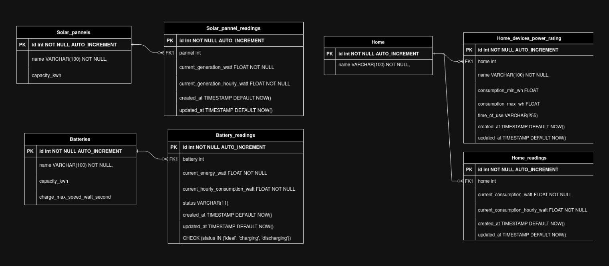

# **Solar-X: A High Performance Real-Time Solar Energy Monitoring and Management System**


### **Overview**

Solar-X is a **real-time solar energy monitoring and management system** designed to track, analyze, and optimize solar energy generation, battery storage, and home power consumption. The system leverages **Kafka for real-time data streaming**, a **Relational Mysql database** for long-term storage, **Node.js-based backend**, **React.js real-time dashboard**, **Nginx** as web-server and reverse proxy and **Docker and Docker Compose** for easy deployment.

The data powering Solar-X is collected from various energy sources and is logged into Kafka before being processed and stored in a database. This enables efficient querying, analytics, and visualization of solar energy data.


### **Key Components**

#### **1. Data Ingestion & Streaming (Kafka)**
- **Data Sources**:
    - **Solar Panels**: Measures real-time energy generation.
    - **Batteries**: Tracks charge/discharge states and capacity.
    - **Home Energy Consumption**: Monitors device-level power usage.

- **Kafka Producers** (`solar_producer`, `batteries_producer`, `home_energy_consumption_producer`) push energy readings into dedicated topics:
    - `solar_energy_topic`
    - `batteries_usage_topic`
    - `home_usage_topic`

- **Kafka Consumer**: 
	- `kafka_to_db` Reads and processes data from Kafka and inserts it into the **database hourly and update it every minute**.
	- `backend` Reads and processes data from Kafka and inserts and pass it to React frontend with web-socket connections.


---

#### **2. Data Storage & Modeling (Relational Database)**

- The project employs a **structured data model**, optimizing data retrieval and analysis.
- **Database Schema Includes**:
    - **Solar Panels** (`solar_panels`, `solar_panel_readings`): Logs energy production.
    - **Batteries** (`batteries`, `battery_readings`): Stores charge levels, energy usage, and status.
    - **Home Consumption** (`home`, `home_readings`, `home_devices_power_rating`): Tracks energy usage for home and per device.
    
---

#### **3. Backend & API**
- A **Node.js-based backend** manages real-time WebSocket updates.
- Data from the **kafka** is exposed to clients for real-time monitoring.
- The backend is containerized and deployed using **Docker** easy deployment.

---

#### **4. Frontend & Visualization**
- **React.js Dashboard** provides an intuitive UI to monitor:
    - Real-time energy generation.
    - Battery charge/discharge status.
    - Home energy consumption patterns.
- **Nginx** as a web-server and reverse proxy and optimizes WebSocket communication.

---

### **Conclusion**

**Solar-X** is a **fully integrated solar energy monitoring platform**, leveraging **Kafka, relational databases, nodejs, react, nginx and Docker** to provide a real-time, scalable, and efficient energy management solution. By combining **streaming data, structured storage, and intuitive visualization**, Solar-X enables precise energy tracking and optimization for **homes and solar farms**.


---

### Technologies Used
- `Python` for data processing and etl work
- `Kafka` for handling the data stream per second
- `Nodejs` and python for the backend
- `Web-socket` for the communication between the backend and the frontend
- `React` for the frontend
- `MySQL` database to store the solar and home and batteries energies per hour (updated per minute)
- `Phpmyadmin` for monitoring the database
- `Docker` and `Docker-compose`
- `Nginx` as a reverse proxy to facilitate communication

<br/>

### Project Diagram


<br/>

### ERD Diagram


<br/>

### Demo


https://github.com/user-attachments/assets/3f5eab5e-ebdb-4df1-9d1b-84936c0704d8


<br/>
<br/>

### Env files needed for the project

1- under `mysql_database`
```env
DATABASE_USER='solarx'
DATABASE_PASSWORD='password'
DATABASE_HOST='solarx-db'
DATABASE_NAME='SolarX'
DATABASE_PORT='3306'
KAFKA_BROKER_ADDRESS="kafka:9092" 
```


2- under `kafka-websocket`
```env
BROKER_HOST='kafka'
```


3- under `frontend-gui`
Note that `localhost` will need to e changed to the host domain name or host ip 
if other devices on the host network will connect to the application

```env
REACT_APP_WS1_URL="ws://localhost:4000/ws1/"
REACT_APP_WS2_URL="ws://localhost:4000/ws2/"
REACT_APP_WS3_URL="ws://localhost:4000/ws3/"
```

4- under `solar-x` the root
```env
KAFKA_BROKER_ADDRESS="kafka:9092"
```


<br/>
<br/>

### A Lakehouse project for this app is currently in progress in this repo
https://github.com/eslamdyab21/SolarX-Lakehouse