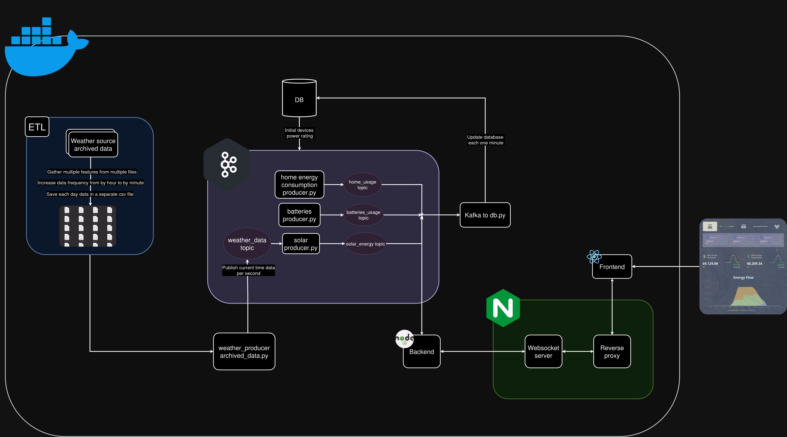

# solar-x
SolarX is a project aiming to practice a number of different tools, from the databases and etl related work, data streaming using kafka, data processing with kafka and python, web-sockets in the nodejs backend with kafka, to sending the data to the react frontend with web-sockets, with under docker and docker compose.

 

### Technologies used in this project
- Python for data processing and etl work
- Kafka for handling the data stream per second
- Nodejs and python for the backend
- Web-socket for the communication between the backend and the frontend
- React for the frontend
- MySQL database to store the solar and home and batteries energies per hour (updated per minute)
- Phpmyadmin for monitoring the database
- Docker and Docker-compose

 

### Project Diagram

 

### ERD Diagram

 

### Demo

https://github.com/user-attachments/assets/3f5eab5e-ebdb-4df1-9d1b-84936c0704d8

